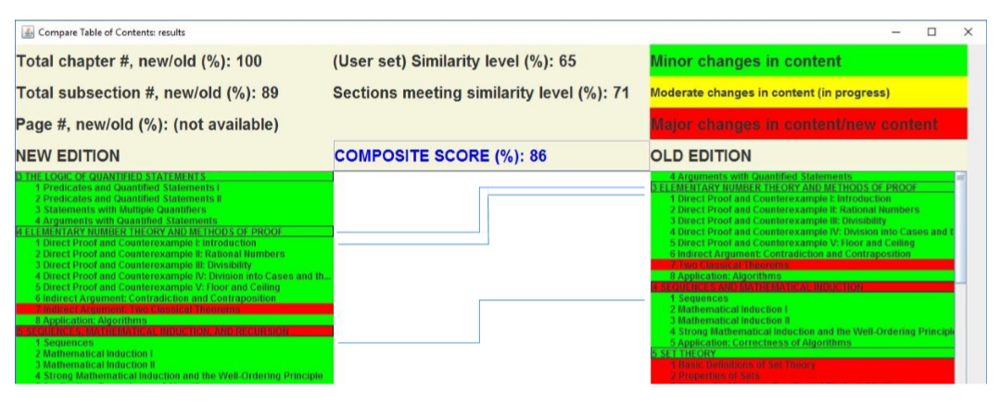

## A desktop app for displaying change logs between table of contents of different editions of books
This is a project to create an application that tells a customer the high level differences between different editions of books, according to their table of contents. A customer using this app can quickly find the difference by quantitative measures instead of having to compare the books manually.
Consequently, book sellers can benefit from less returned products. 

### Features
* Accepts user's choice of similarity level for string matching
* Display changes in chapter contents by color codes
* Uses third party library for calculating string similarity
* Uses MVC design pattern to make components loosely coupled

<p align="center">
  
</p>

### Getting started
Running the source code of this project requires a Java JDK.
To start this project locally, run: 
```
javac Controller.java
java Controller
```

### Future work
Further work could include:
1. Use a modern JavaScript framework to replace GWT
2. Adding a database for archiving table of contents for each book
3. More intuitive user facing components
4. Multiple tabs to display same content, major revision, new chapters 